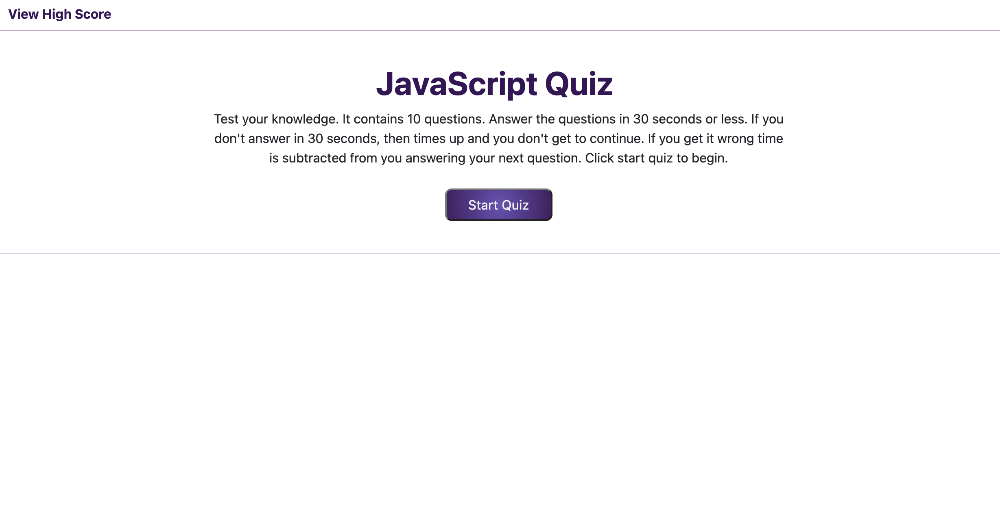
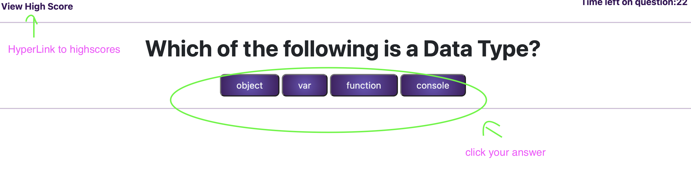
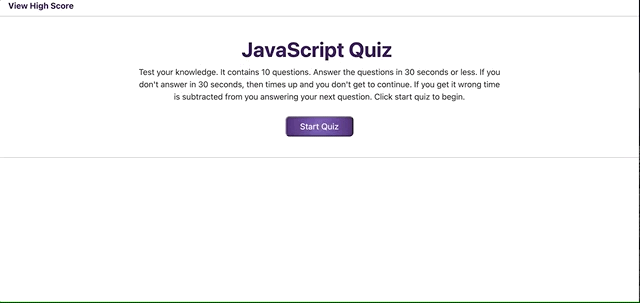
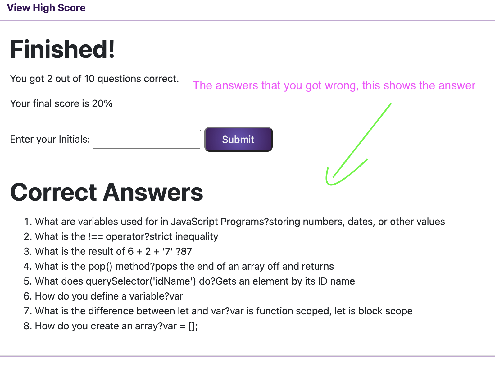

# JavaScript Quiz

## Description
---

A timed quiz, that asks the user a series of JavaScript questions fundamentals and at the end saves the scores with local storage. This was designed for anyone who is interested in JavaScript. I wanted to create this to help quiz myself, that way I am better prepared for interviews in the future. This quiz is user friendly and easy to use.

    Some of the concepts I learned from this:
    * setTimout
    * setInterval
    * JSON
    * localStorage, getItem, setItem
    * createElement
    * setAttribute
    * eventListner
    * preventDefault
    * removeChild

    I further understood:
    * functions
    * using styling in js
    * for loops

url: https://dorley1993.github.io/code_quiz/

## Table of Contents
---
* [Languages](#Languages)
* [Usage](#Usage)
* [License](#License)

## Languages
---
* JavaScript
* HTML
* CSS

## Usage
---
Opening the website. You will see the starting area for the quiz. This page contains a small paragraph with directions, a hyperlink on the navbar which leads to the highscores area, and a button to start the quiz.

Click the start quiz button to begin, you will see hyperlink to the high scores area and timer in the navbar area, then you will see the questions. They have four purple buttons. If you get a question wrong you will have less time on the next question.

 

 

Here is a video going through the quiz.

 

 
 

Once you've answered each question, you will see your score on the page and a prompt for your initials. Enter your initials and hit submit, when you are ready. You can also look over the correct answers to what you got wrong. 

 

After submitting, you will see the high scores page. This will list the scores that you previously had. You can reset the scores or return to restart the quiz again.

## License
---
Copyright © Danielle Orley 

Permission is hereby granted, free of charge, to any person obtaining a copy of this software and associated documentation files (the "Software"), to deal in the Software without restriction, including without limitation the rights to use, copy, modify, merge, publish, distribute, sublicense, and/or sell copies of the Software, and to permit persons to whom the Software is furnished to do so, subject to the following conditions:

The above copyright notice and this permission notice shall be included in all copies or substantial portions of the Software.

THE SOFTWARE IS PROVIDED "AS IS", WITHOUT WARRANTY OF ANY KIND, EXPRESS OR IMPLIED, INCLUDING BUT NOT LIMITED TO THE WARRANTIES OF MERCHANTABILITY, FITNESS FOR A PARTICULAR PURPOSE AND NONINFRINGEMENT. IN NO EVENT SHALL THE AUTHORS OR COPYRIGHT HOLDERS BE LIABLE FOR ANY CLAIM, DAMAGES OR OTHER LIABILITY, WHETHER IN AN ACTION OF CONTRACT, TORT OR OTHERWISE, ARISING FROM, OUT OF OR IN CONNECTION WITH THE SOFTWARE OR THE USE OR OTHER DEALINGS IN THE SOFTWARE.

